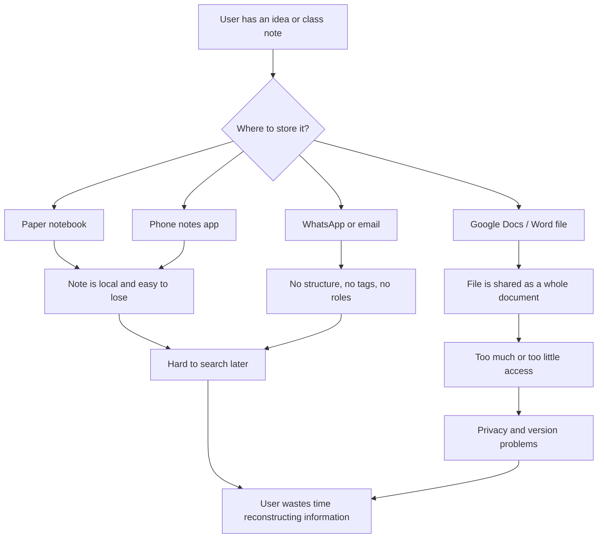
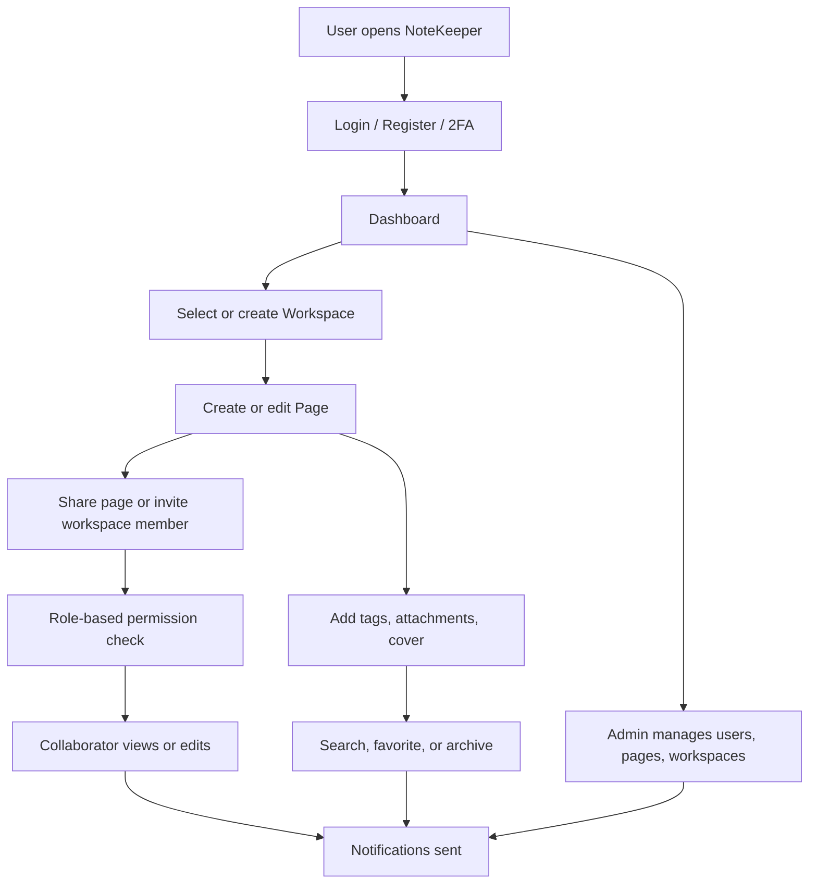
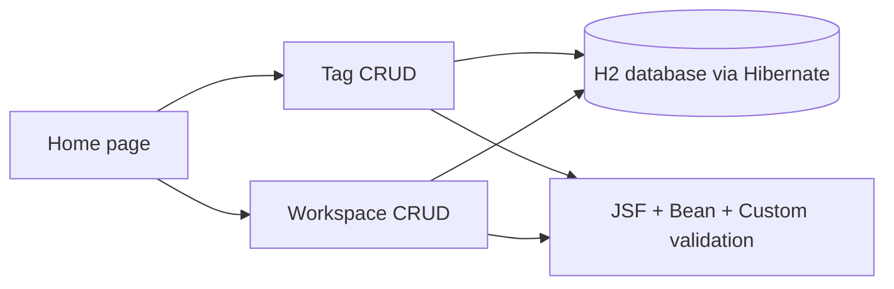
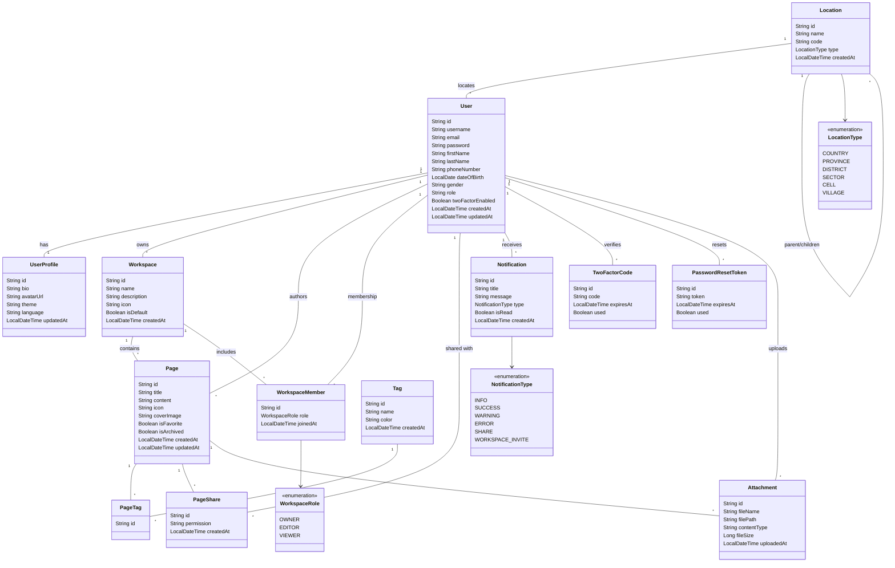

# NoteKeeper Phase-1 Project Proposal

**Project title:** NoteKeeper – A Collaborative Note-Taking and Workspace System  
**Student / author:** Jessica Irakoze  
**Repository (public GitHub link):** https://github.com/Jess-xca/Notekeeper_JSF  
**Video link (Google Vid, screen + camera, 5–10 minutes):** `[PASTE GOOGLE VID LINK HERE]`  
**Technology stack for this phase:** JSF, Hibernate, H2, Maven, Jakarta Validation  

---

## 1. Abstract

NoteKeeper is a web-based note-taking platform designed for students, professionals, and small teams who need one place to write, organize, share, and protect their notes. The full product supports user accounts, workspaces, pages, tags, attachments, sharing, notifications, two-factor authentication, and administration.

Phase-1 focuses on project definition and a practical proof of concept. The documentation below describes the problem, scope, current versus future process, business requirements, software qualities, and the initial class model for all planned entities. The practical implementation uses **JSF and Hibernate** to perform full **CRUD** on two selected entities: **Tag** and **Workspace**. The prototype applies three validation types (JSF built-in validators, Bean Validation, and custom validators) and three CSS types (external, internal, and inline).

---

## 2. Problem Statement

People currently keep notes in many disconnected places: paper notebooks, phone memos, email drafts, chat messages, and generic cloud documents. This creates several problems:

1. Notes are hard to find later because there is no consistent structure, tagging, or workspace grouping.
2. Collaboration is unsafe or incomplete. Sending a file or sharing a whole folder often gives more access than needed.
3. Important notes can be lost when a device fails or an account is closed, and there is no clear ownership or archive process.
4. Security is weak. Shared passwords, no two-factor authentication, and no role control expose private content.
5. Administrators of a class, office, or organization cannot see or manage users, workspaces, and content from one system.

NoteKeeper addresses this by providing a dedicated system where notes (pages) live inside workspaces, can be labeled with tags, shared with controlled roles, and protected through authentication and user management.

---

## 3. Scope of the Project

### 3.1 In scope (full project)

- User registration, login, password reset, Google login, and email-based 2FA
- User profiles, roles (`USER`, `EDITOR`, `ADMIN`), and location data
- Workspaces with members and roles (`OWNER`, `EDITOR`, `VIEWER`)
- Pages with content, icons, cover images, favorites, archive, and attachments
- Tags and page-tag relationships
- Page sharing and workspace invitations
- Notifications
- Admin management of users, pages, and workspaces

### 3.2 In scope (Phase-1 practical work)

- Project proposal documentation (this document)
- Initial class diagram for all planned entities
- JSF + Hibernate CRUD for **Tag** and **Workspace**
- Three validation types and three CSS types
- Public GitHub repository
- 5–10 minute Google Vid recording of the proposal and CRUD workflow

### 3.3 Out of scope for Phase-1

- Full authentication screens in JSF
- Page editor, attachments, sharing, and notifications in JSF
- Production deployment and mobile applications

Phase-1 stores workspace owner as a name field so the two chosen entities can be demonstrated independently. In the full system, a workspace belongs to a `User`.

---

## 4. AS-IS Model

Today, a student or staff member who wants to keep and share notes follows a fragmented manual process.



**AS-IS characteristics**

| Area | Current practice |
|---|---|
| Capture | Notes written in whatever tool is nearest |
| Organization | Folders or none; tags rarely consistent |
| Search | Manual scrolling or memory |
| Sharing | Send a copy or share a whole file |
| Security | Device lock or account password only |
| Collaboration | Conflicting copies and unclear ownership |
| Administration | No central view of users or content |

---

## 5. TO-BE Model

NoteKeeper replaces the scattered process with one authenticated web system.



**TO-BE characteristics**

| Area | Future practice |
|---|---|
| Capture | Pages created inside a workspace |
| Organization | Workspaces + tags + archive + favorites |
| Search | Title and content search with filters |
| Sharing | Controlled page shares and workspace roles |
| Security | JWT/session auth, hashed passwords, 2FA |
| Collaboration | One live record instead of file copies |
| Administration | Dedicated admin screens |

Phase-1 TO-BE slice (what is implemented now):



---

## 6. Business Requirements

### 6.1 Functional requirements

| ID | Requirement |
|---|---|
| BR-01 | A user must be able to register, log in, reset a password, and optionally enable 2FA. |
| BR-02 | A user must be able to create and manage workspaces. |
| BR-03 | A user must be able to create, edit, favorite, archive, and delete pages inside a workspace. |
| BR-04 | A user must be able to create tags and assign them to pages. |
| BR-05 | A workspace owner must be able to invite members and assign roles. |
| BR-06 | A page owner must be able to share a page with view or edit permission. |
| BR-07 | The system must store attachments linked to a page. |
| BR-08 | The system must notify users about shares and invitations. |
| BR-09 | An administrator must manage users, pages, and workspaces. |
| BR-10 | Invalid data must be rejected through validation before it is saved. |

### 6.2 Phase-1 functional requirements (implemented)

| ID | Requirement | Status |
|---|---|---|
| P1-01 | Create, read, update, and delete tags | Implemented |
| P1-02 | Create, read, update, and delete workspaces | Implemented |
| P1-03 | Validate tag name and color | Implemented |
| P1-04 | Validate workspace name, owner, and description | Implemented |
| P1-05 | Persist records with Hibernate using `hibernate.xml` | Implemented |

### 6.3 Non-functional / business constraints

- The system should be usable from a standard web browser.
- Personal notes must remain visible only to authorized users in the full system.
- Forms must give clear error messages when input is invalid.
- The Phase-1 prototype must be easy to run locally for demonstration and marking.

---

## 7. Software Qualities Applied in the System

| Quality | How it is applied |
|---|---|
| **Functionality** | CRUD for tags and workspaces; planned modules cover notes, sharing, and admin. |
| **Usability** | Simple JSF forms, labels, required-field hints, confirm-before-delete, and success/error messages. |
| **Reliability** | Hibernate transactions with rollback on failure; validation before persist. |
| **Security** | Full system uses hashed passwords, JWT, 2FA, and role checks. Phase-1 validates input to reduce bad or malicious data. |
| **Maintainability** | Layered design: model, DAO, bean, validator, and XHTML views. |
| **Scalability** | Entity model supports many users, workspaces, and pages; later API/database can grow independently of the JSF prototype. |
| **Portability** | Maven WAR can run on Tomcat 10 / Jakarta EE containers; H2 is used for local demo. |
| **Integrity** | Unique tag names, required fields, and reserved workspace names protect data quality. |
| **Reusability** | Shared CSS, DAO pattern, and validators can be reused for later entities. |
| **Testability** | DAO operations and validators are isolated from the view, so they can be tested independently. |
| **Efficiency** | Only required fields are loaded in list screens; H2 file database is lightweight for demo. |
| **Adaptability** | The same entities map to the Spring Boot backend, so the JSF prototype can evolve toward the full product. |

---

## 8. Initial Class Diagram (All Entities)

The full NoteKeeper domain is shown below. Phase-1 implements **Tag** and **Workspace** (workspace owner is a string in the JSF prototype).



---

## 9. Phase-1 Practical Implementation

### 9.1 Selected entities

| Entity | Why it was selected |
|---|---|
| **Tag** | Small, clear entity with uniqueness and format rules. Good for showing all validation types. |
| **Workspace** | Core NoteKeeper concept. Shows required fields, length checks, reserved-name custom validation, and list/edit/delete. |

### 9.2 CRUD mapping

| Operation | Tag | Workspace |
|---|---|---|
| Create | Save Tag form | Save Workspace form |
| Read | All Tags table | All Workspaces table |
| Update | Edit loads the form, then Update | Edit loads the form, then Update |
| Delete | Delete with confirmation | Delete with confirmation |

### 9.3 Three types of validation

| Type | Where it is applied |
|---|---|
| **1. JSF built-in validators** | `required="true"`, `<f:validateLength>`, `<f:validateRegex>` on the XHTML forms |
| **2. Bean Validation** | `@NotBlank`, `@Size`, `@Pattern` on `Tag.java` and `Workspace.java` |
| **3. Custom validators** | `UniqueTagNameValidator`, `HexColorValidator`, `WorkspaceNameValidator` |

### 9.4 Three types of CSS

| Type | Where it is applied |
|---|---|
| **External CSS** | `src/main/webapp/resources/css/app.css` included with `<h:outputStylesheet>` |
| **Internal CSS** | `<style>` blocks in `index.xhtml`, `tags.xhtml`, and `workspaces.xhtml` |
| **Inline CSS** | `style="..."` attributes, for example the color swatch `style="background-color: #{item.color};"` and selected headings |

### 9.5 How to run the practical project

Requirements: JDK 17 and Maven.

```bash
cd JSF
mvn clean package
mvn cargo:run
```

Then open:

- Home: http://localhost:8081/notekeeper-jsf/
- Tags: http://localhost:8081/notekeeper-jsf/tags.xhtml
- Workspaces: http://localhost:8081/notekeeper-jsf/workspaces.xhtml

Sample records are created automatically on first start.

---

## 10. Public GitHub Link

**https://github.com/Jess-xca/Notekeeper_JSF**

The repository must remain **public** so the lecturer can open the source code without access requests.

---

## 11. Video Record (Google Vid)

**Duration:** 5–10 minutes  
**Required features:** screen recording and camera (picture-in-picture)  
**Tool:** Google Vid  
**Link:** `[PASTE GOOGLE VID LINK HERE after recording]`

### Suggested recording script

1. **0:00–1:00** – Introduce yourself, the project name, and the problem NoteKeeper solves. Show your face with the camera.  
2. **1:00–3:00** – Walk through this proposal: abstract, problem, scope, AS-IS vs TO-BE, business requirements, and class diagram.  
3. **3:00–8:00** – Run the JSF app. Show Tag CRUD: create a valid tag, try invalid data (short name, bad color, duplicate name), then edit and delete. Repeat for Workspace CRUD, including a reserved name such as `admin`. Point to external, internal, and inline CSS in the browser/source.  
4. **8:00–10:00** – Show the GitHub repository, summarize future work, and close.

After recording, set the Google Vid sharing permission to anyone with the link, then paste the URL in the field above and in the README.

---

## 12. Conclusion

Phase-1 defines NoteKeeper as a structured alternative to scattered personal notes and uncontrolled file sharing. The documentation captures the problem, scope, current and future models, requirements, qualities, and the full entity design. The JSF and Hibernate prototype proves that two core entities can be created, displayed, updated, deleted, and validated with the required presentation techniques. Later phases will connect the remaining entities, authentication, sharing, and administration to complete the product.
